# Python War Economics Analysis

Projekt analizy ekonomicznego wpływu wojen: odporność gospodarcza, ubóstwo i brak bezpieczeństwa żywnościowego w konflikcie, czarny rynek i nieformalność oraz koszty wojny vs odbudowy. Wykorzystuje zestaw danych z Kaggle i generuje zestaw wykresów oraz podsumowań dla każdej analizy.

**→ [English version (README_EN.md)](README_EN.md)**

---

## Dataset

Wykorzystywany jest zbiór **War Economic & Livelihood Impact Dataset** (Likitha Gedipudi) z serwisu Kaggle:

- **Źródło:** [https://www.kaggle.com/datasets/likithagedipudi/war-economic-and-livelihood-impact-dataset](https://www.kaggle.com/datasets/likithagedipudi/war-economic-and-livelihood-impact-dataset)
- **Opis:** Zbiór na poziomie konfliktów (ok. 100 000 wierszy), od II wojny światowej po konflikty współczesne. Zawiera m.in. zmiany PKB, inflację, skrajne ubóstwo, brak bezpieczeństwa żywnościowego, rozmiar gospodarki nieformalnej, poziom czarnego rynku, koszty wojny i szacowane koszty odbudowy, typ konfliktu i region.
- **Plik w projekcie:** Po pobraniu z Kaggle zapisz plik CSV jako `dataset/war_economic_impact_dataset.csv` (nazwa kolumn musi odpowiadać tej używanej w kodzie, np. `Conflict_Type`, `GDP_Change_%`, `Inflation_Rate_%`, `Cost_of_War_USD`, `Estimated_Reconstruction_Cost_USD` itd.).

---

## Uruchomienie projektu (środowisko .venv)

### 1. Utworzenie i aktywacja wirtualnego środowiska

W katalogu projektu:

```bash
python3 -m venv .venv
```

Aktywacja:

- **macOS/Linux:** `source .venv/bin/activate`
- **Windows (cmd):** `.venv\Scripts\activate.bat`
- **Windows (PowerShell):** `.venv\Scripts\Activate.ps1`

### 2. Instalacja zależności

```bash
pip install -r requirements.txt
```

### 3. Umieszczenie danych

Pobierz dataset z Kaggle i umieść plik CSV w katalogu `dataset/` jako:

```
dataset/war_economic_impact_dataset.csv
```

### 4. Uruchomienie analiz

```bash
.venv/bin/python main.py
```

Skrypt ładuje dane, uruchamia kolejno cztery moduły analiz i zapisuje wykresy w katalogu `output/<nazwa_analizy>/`. W konsoli pojawiają się krótkie podsumowania (liczby obserwacji, wygenerowane pliki, wybrane statystyki).

---

## Struktura projektu

```
Python_War_Economics_Analysis/
├── config/           # ścieżki, nazwa pliku CSV
├── core/             # ładowanie i normalizacja danych (data_loader.py)
├── utils/             # pomocnicze (np. zapis wykresów)
├── analyses/         # moduły analiz (każdy: constants, charts, analysis, __init__)
│   ├── economic_resilience_hyperinflation/
│   ├── poverty_and_food_insecurity/
│   ├── black_market_informal_economy/
│   └── war_reconstruction_costs/
├── dataset/          # tu: war_economic_impact_dataset.csv
├── output/           # wygenerowane wykresy (podkatalogi per analiza)
├── main.py
├── requirements.txt
├── README.md          # wersja polska
└── README_EN.md       # English version
```

---

## Przeprowadzone analizy, wykresy i wyniki

### 1. Odporność gospodarcza i hiperinflacja  
*(economic_resilience_hyperinflation)*

- **Pytanie:** Przy jakim spadku PKB rośnie ryzyko wysokiej inflacji (np. >50%)?
- **Wykresy (w `output/economic_resilience_hyperinflation/`):**
  - **chart_scatter_gdp_vs_inflation.png** — rozkład zmiany PKB vs inflacja, kolor wg typu konfliktu; linia progu 50%.

  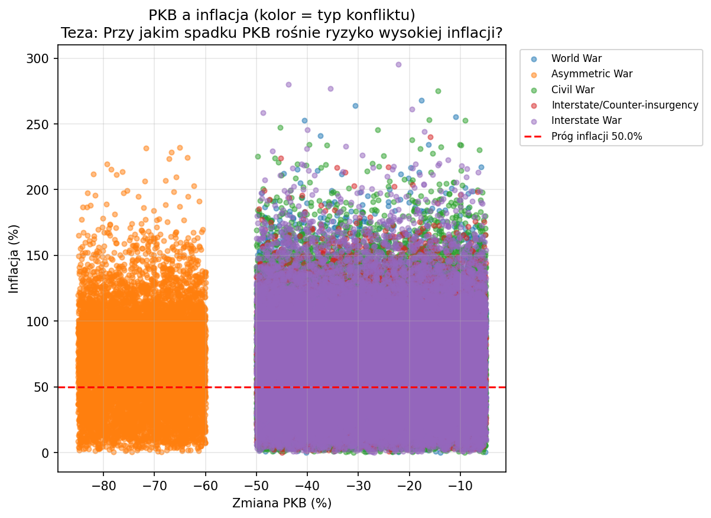

  - **chart_hexbin_gdp_vs_inflation.png** — gęstość obserwacji (PKB vs inflacja), hexbin.

  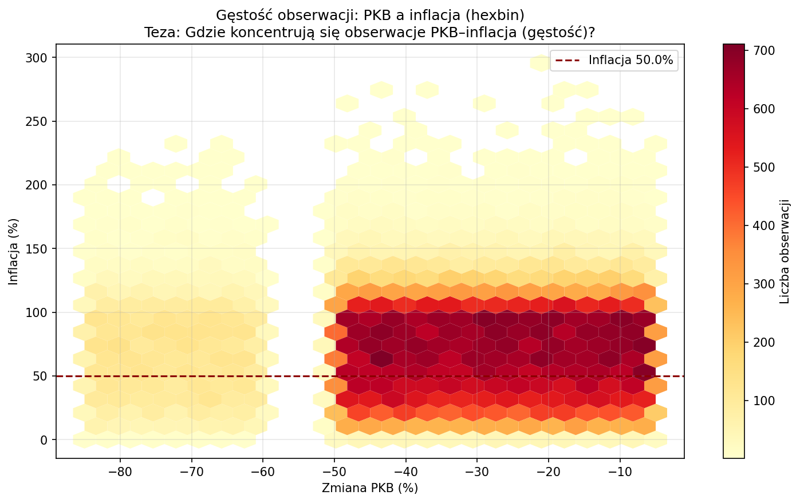

  - **chart_bar_inflation_threshold_by_gdp_bin.png** — przedziały zmiany PKB vs odsetek obserwacji z inflacją >50%.

  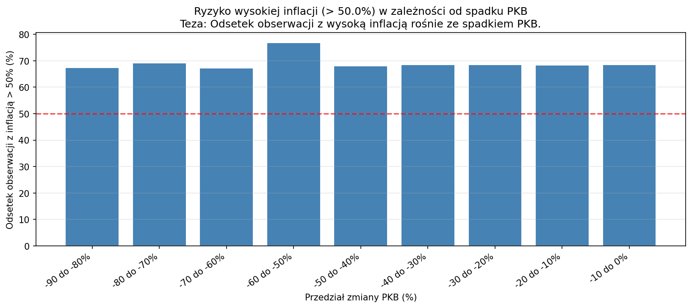

- **Wyniki:** Pokazują zależność między spadkiem PKB a częstością wysokiej inflacji; im głębszy spadek PKB, tym wyższy odsetek przypadków przekraczających próg inflacji.

---

### 2. Ubóstwo i brak bezpieczeństwa żywnościowego w konflikcie  
*(poverty_and_food_insecurity)*

- **Co robimy:** Analizujemy, które regiony i typy konfliktów charakteryzują się najwyższym skrajnym ubóstwem i brakiem bezpieczeństwa żywnościowego (złożony wskaźnik: wskaźnik ubóstwa, głód, gospodarstwa wpadające w ubóstwo). Identyfikujemy najbardziej dotknięte obszary i typy konfliktów w danych — to nie jest priorytetyzacja alokacji pomocy.
- **Pytanie:** Które regiony i typy konfliktów łączą się z najwyższym skrajnym ubóstwem i brakiem bezpieczeństwa żywnościowego?
- **Wykresy (w `output/poverty_and_food_insecurity/`):**
  1. **chart_food_insecurity_by_region.png** — Brak bezpieczeństwa żywnościowego wg regionu.  
     Teza: Które regiony mają najwyższy poziom braku bezpieczeństwa żywnościowego?  
     **Wynik:** Najwyższy poziom braku bezpieczeństwa żywnościowego występuje w regionie Middle East; w pozostałych regionach wartości są zbliżone.

  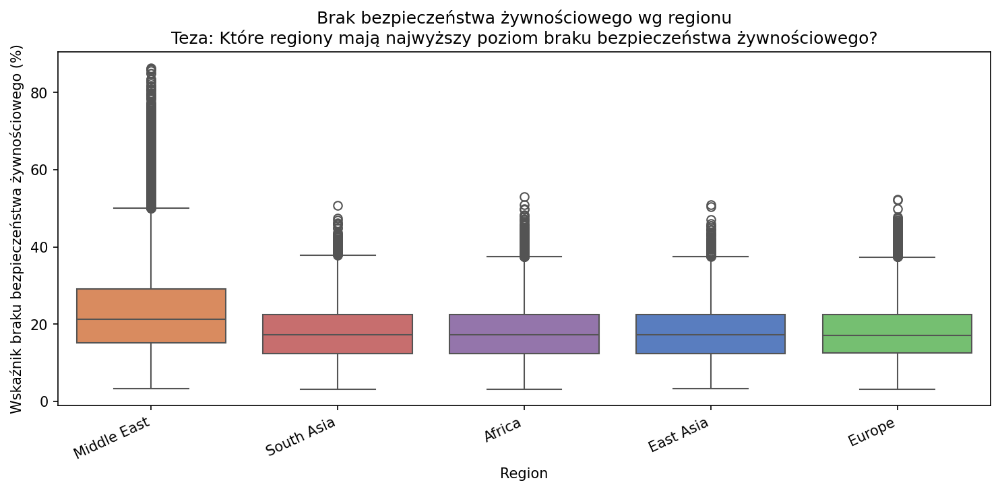

  2. **chart_extreme_poverty_by_conflict_type.png** — Skrajne ubóstwo wg typu konfliktu.  
     Teza: Który typ konfliktu wiąże się z najwyższym skrajnym ubóstwem?  
     **Wynik:** Najwyższe skrajne ubóstwo wiąże się z konfliktami typu Asymmetric war, na drugim miejscu plasuje się Civil war; pozostałe typy konfliktów różnią się nieznacznie. Możliwa interpretacja: wojny asymetryczne i wojny domowe często następują po głównych konfliktach zbrojnych, gdy ludność jest już skrajnie wyczerpana.

  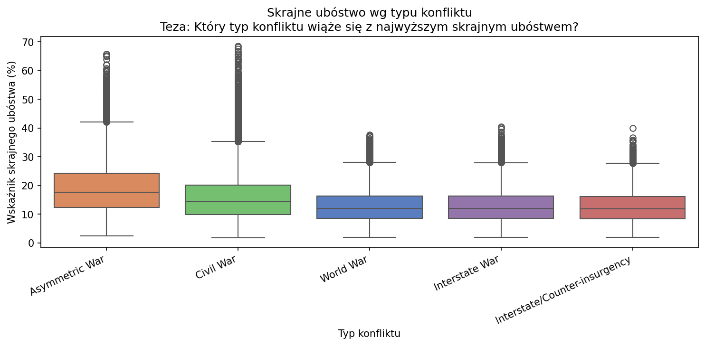

  3. **chart_region_vulnerability_ranking.png** — Ranking regionów najbardziej dotkniętych ubóstwem i brakiem bezpieczeństwa żywnościowego (złożony wskaźnik wrażliwości).  
     Teza: Które regiony są najbardziej dotknięte (złożony wskaźnik: ubóstwo, głód, gospodarstwa w ubóstwie)?  
     **Wynik:** Region Middle East osiąga nieco wyższą wartość złożonego wskaźnika; w pozostałych regionach wartości są zbliżone. Ubóstwo i głód w czasie wojny w mniejszym lub większym stopniu dotykają wszystkich regionów.

  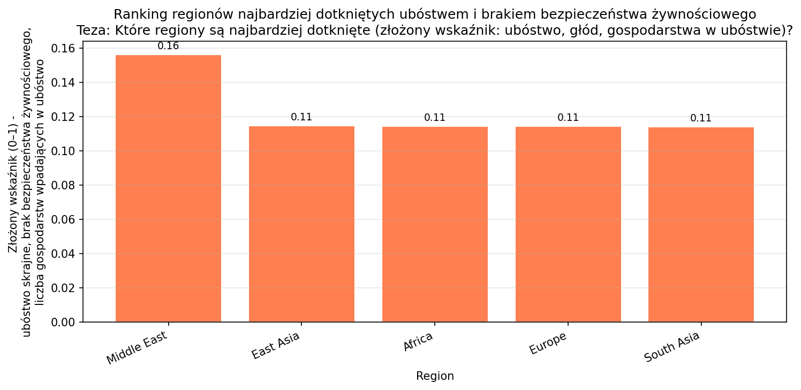

---

### 3. Czarny rynek i gospodarka nieformalna  
*(black_market_informal_economy)*

- **Pytanie:** Jak wojna wpływa na nieformalność i czarny rynek? Czy większy spadek PKB wiąże się z większym wzrostem nieformalności?
- **Wykresy (w `output/black_market_informal_economy/`):**
  - **chart_scatter_gdp_vs_informality_growth.png** — średni wzrost nieformalności i zmiana PKB wg poziomu czarnego rynku.

  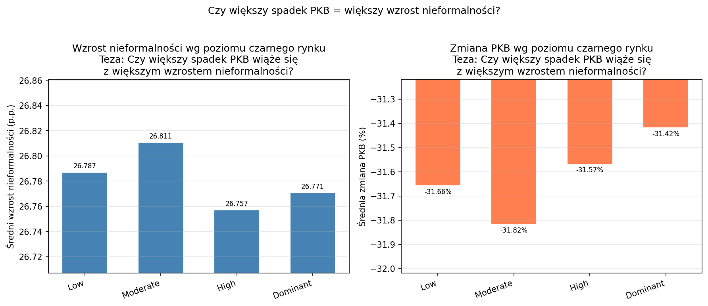

  - **chart_bar_currency_gap_by_conflict_type.png** — średnia luka kursu czarnorynkowego (%) wg typu konfliktu.

  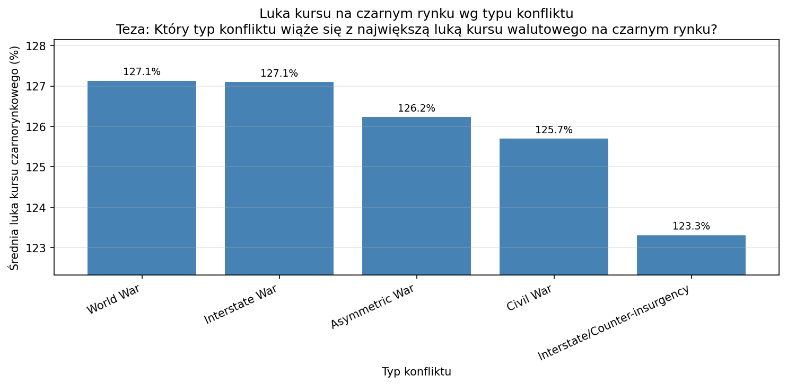

  - **chart_bar_informal_during_by_conflict_type.png** — średni rozmiar gospodarki nieformalnej w trakcie wojny (%) wg typu konfliktu.

  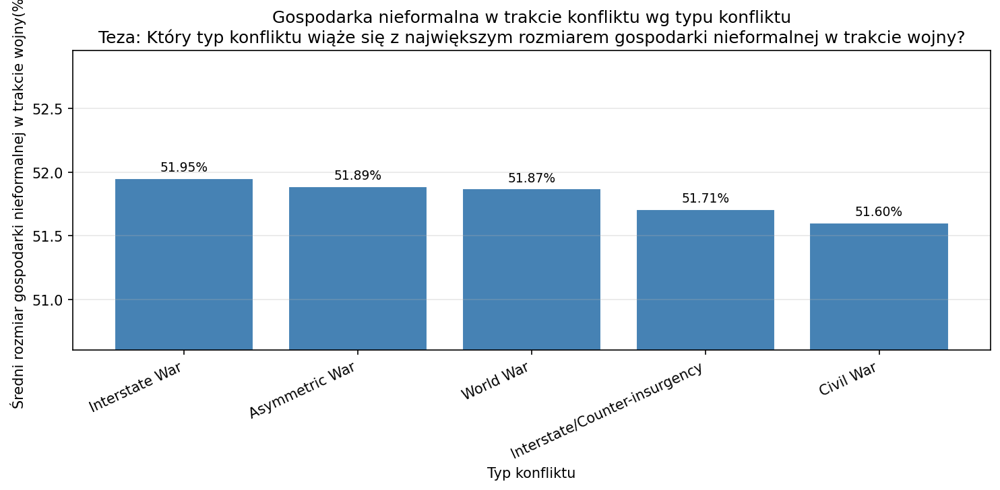

  - **chart_black_market_level_by_region_and_period.png** — rozkład i średni poziom czarnego rynku wg regionu (starsze vs od 2010).

  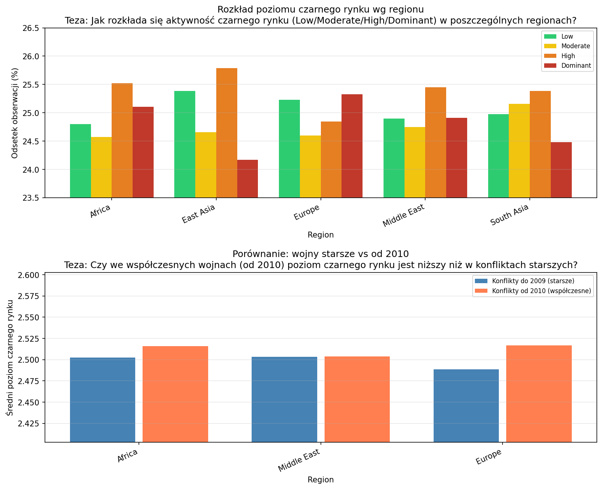

  - **chart_black_market_goods_and_inflation.png** — częstość towarów na czarnym rynku i średnia inflacja.

  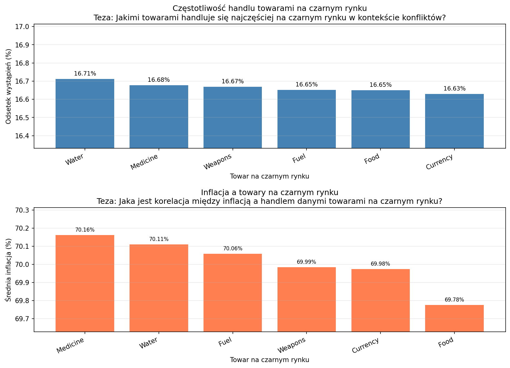

- **Wyniki:** Powiązanie spadku PKB z wzrostem nieformalności; różnice między typami konfliktów i regionami; typowe towary na czarnym rynku i ich związek z inflacją („Black Market Research”, war profiteering).

---

### 4. Koszty wojny vs koszty odbudowy  
*(war_reconstruction_costs)*

- **Pytanie:** Kiedy koszt odbudowy przewyższa koszt wojny? Jak stosunek odbudowa/wojna zależy od typu konfliktu? Czy koszty (wojny i odbudowy) są wyższe w konfliktach współczesnych (od 2010) czy starszych?
- **Wykresy (w `output/war_reconstruction_costs/`):**
  - **chart_bar_ratio_by_conflict_type.png** — średni stosunek koszt odbudowy / koszt wojny wg typu konfliktu (linia 100% = odbudowa = koszt wojny).

  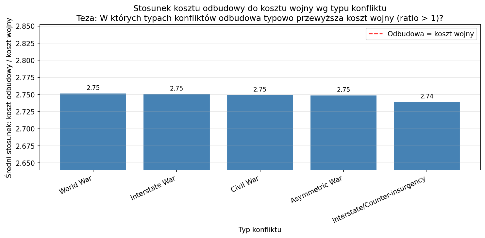

  - **chart_reconstruction_and_war_cost_contemporary_vs_old.png** — porównanie kosztów odbudowy i wojny: konflikty od 2010 vs przed 2010.

  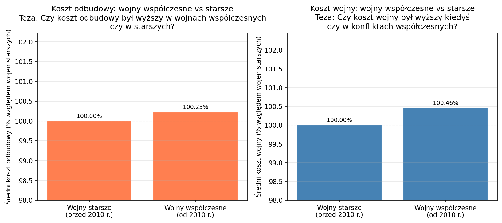

- **Wyniki:** W których typach konfliktów ratio > 1 (odbudowa droższa niż wojna); czy współczesne konflikty (od 2010) charakteryzują się wyższymi lub niższymi kosztami w ujęciu względnym („reconstruction costs”, long-term fiscal burden).

---

## Zależności (requirements.txt)

- pandas ≥ 2.0
- matplotlib ≥ 3.7
- seaborn ≥ 0.12
- numpy ≥ 1.24

---

## Licencja danych

Dataset na Kaggle jest udostępniony na licencji **CC0: Public Domain**. Zastosowanie w tym projekcie zgodne z warunkami Kaggle i licencją zbioru.
